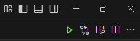

# Latex devcontainer

Environment for writing AFIT theses (or other latex documents)

This environment is intended to be general-purpose and flexible. You can have multiple documents in the same repository, and you can mix Markdown, Latex, and code. I also made sure you can relatively easily migrate between this environment and Overleaf.

The initial setup time is a bit painful, but once the image is built/downloaded, building PDFs is fast. 

Warning: This is a work-in-progress. Contributions are welcome.

## Getting started

Clone this repo, open the folder in VSCode, and reopen in container. This will take a while for the image to download/build.

Next, open `graphing/graphing_main.tex`, click the play icon, then the preview icon.

## Included

1. thesis_template - This is the standard thesis template found on Overleaf. I did a direct copy with no modifications. Chapters are broken out into individual files. No references are made to files outside the thesis_template directory.

1. alt_thesis_template - This is my version of the standard thesis template. It has been modified to use `/tex_resources/*` and includes the drawio import. It also uses a different setup for glossary/acronym/nomenclature.  
   
1. tex_resources - These files are intended to be shared between Latex projects. For example, `/tex_resources/refs.bib` can be maintained as the master list of references, so you don't need to maintain copies for different projects. I use Zotero and "Better BibTex for Zotero" to manage my references. Better BibTex creates a static citation key, so you can make sure your keys don't get modified.

1. drawio - Draw.io is an open-source equivalent to Visio. This environment includes the VSCode extension for Draw.io so you can work offline. To create a drawing, simply create a file in the drawio directory with the extension `.drawio`. I have included a plugin to automatically convert a `.drawio` file to PDF whenever you're building a Latex project. See `graphing/graphing_main.tex` for more an example.

1. graphing - Simple example project for writing general documentaion. Includes two methods for creating graphs (tikz and drawio). 

1. synctex is enabled in the settings:
    - To go from code to pdf:
      - mac: `cmd` + `option` + `j`
      - windows/linux: `ctrl` + `alt` + `j`
    - To go from pdf to code:
      - mac: `cmd` + `click`
      - windows/linux: `ctrl` + `click`

1. ltex provides grammar and spell checking.

## Random notes

I have VSCode set to hide gitignore files to make things cleaner. This can cause confusion if you're not aware.

Gitignore also excludes all PDF files from the repo. You will need to modify this if you begin including figures saved as PDFs.
